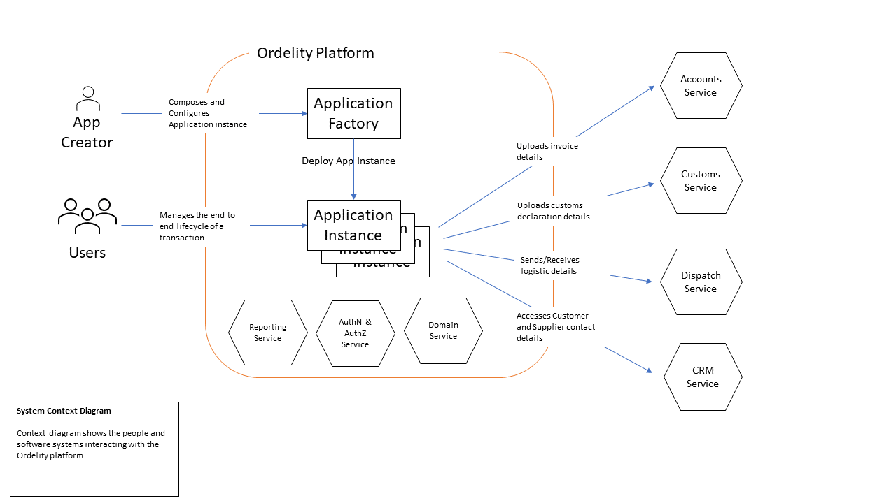
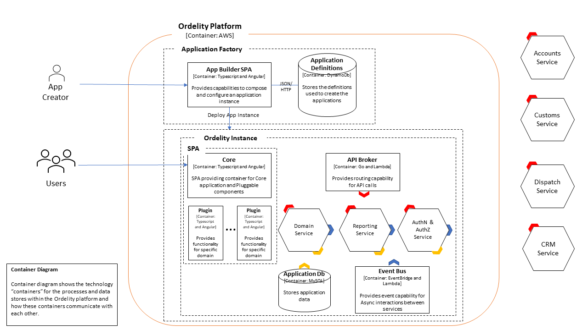

# System Context
The following diagram describes the system level view which shows the actors and external systems interacting with the Ordelity platform.

# Container
The following diagram describes the container level view which shows the components within the Ordelity platform.

