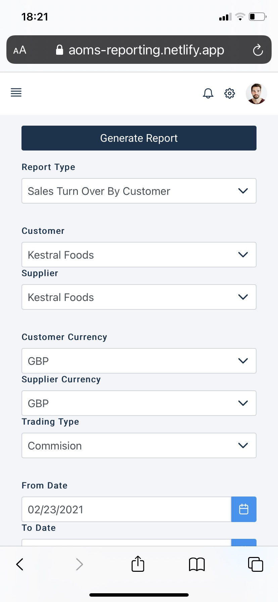
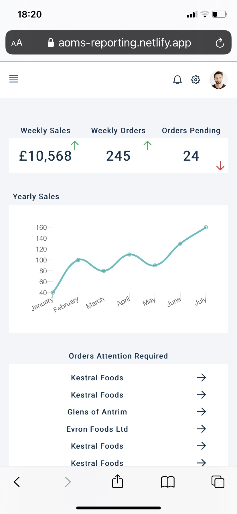
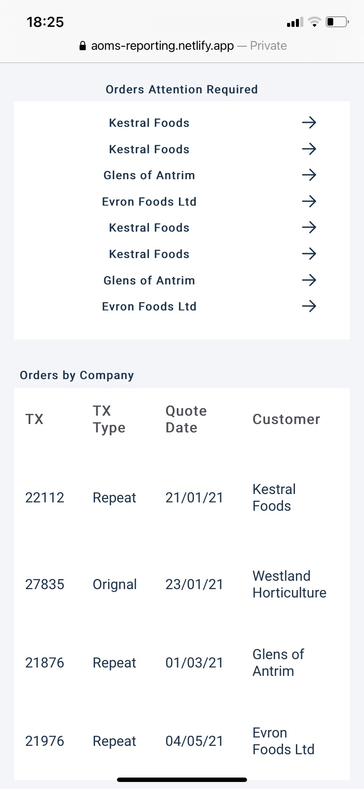

# Ordelity Insights
Insights is a reporting and analytics hub for order management systems. Available on desktop or mobile devices Insights provides a window into your business through traditional reporting, trending analysis and real time notifications of activity as it happens.

<a href="https://aoms-reporting.netlify.app/" target="_blank">Click to see demo</a>

## Reporting

The reporting dashboard is a central place to manage all reporting needs. 

- Generate reports on demand or on schedule from a list of pre-defined report templates
- Store generated reports for a defined period, or permanently if required
- Configure notification settings for report availability
- Configurable selection criteria per report
- Role based access to reports, configurable by administrator

**Generate a report on your phone**
<!---  -->

**Access reports from the file store**
<!--  -->

## Analytics
The analytics dashboard provides trending analysis and flags activity requiring your attention.

- Role based analytics displayed on dashboard
- List of in progress activities with items requiring attention flagged

**Summary information, sales trending and Orders requiring attention** 
<!--  -->

## Real Time Notifications
Get the information you need when you need it through real time notifications. 

- Get notified on your phone or by email as soon as things happen
- Select order transactions to watch, get notifications when there are changes to the transactions
- Set thresholds to trigger notifications, e.g. when a customer hits a credit limit

**Attention Required on orders**
<!--  -->

