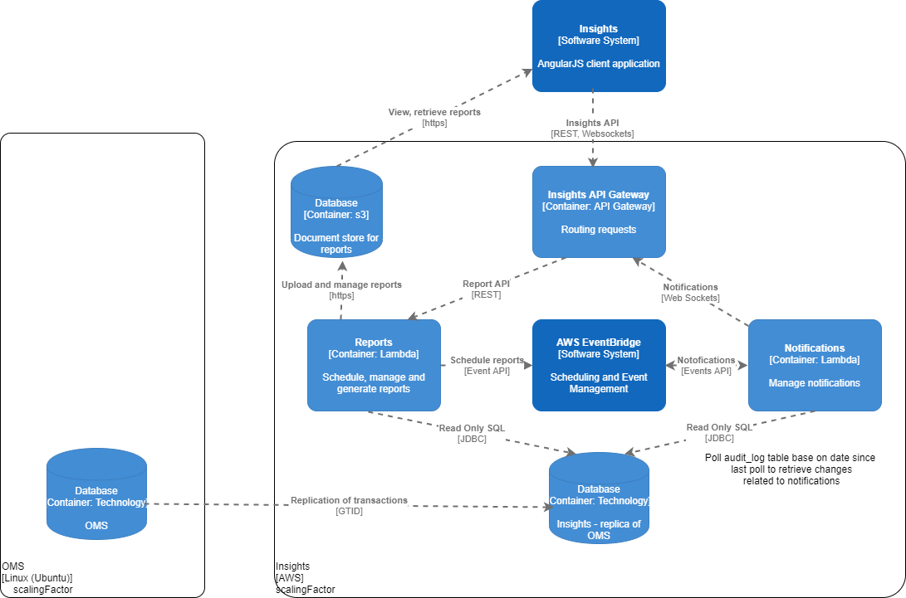

# ordelity-docs
Documentation for ordelity platform

<a href="https://app.diagrams.net/#Hjgraph%2Fdrawio-github%2Fmaster%2Fdiagram.png" rel="nofollow">Edit in diagrams.net</a>
http://jgraph.github.io/drawio-github/edit-diagram.html?repo=drawio-github&path=diagram.png

https://app.diagrams.net/?mode=github#HOrdelity%2Fordelity-docs%2Fmain%2FInsights-Insights%20Container.png

<a href="http://jgraph.github.io/drawio-github/edit-diagram.html?repo=Ordelity%2Fordelity-docs&amp;path=Insights-Insights%20Container.png" rel="nofollow">Edit</a> | <a href="https://app.diagrams.net/#Uhttps%3A%2F%2Fraw.githubusercontent.com%2Fjgraph%2Fdrawio-github%2Fmaster%2Fdiagram.png" rel="nofollow">Edit As New</a> | <a href="https://app.diagrams.net/?mode=github#HOrdelity%2Fordelity-docs%2Fmain%2FInsights-Insights%20Container.png" rel="nofollow">Edit in diagrams.net</a>

